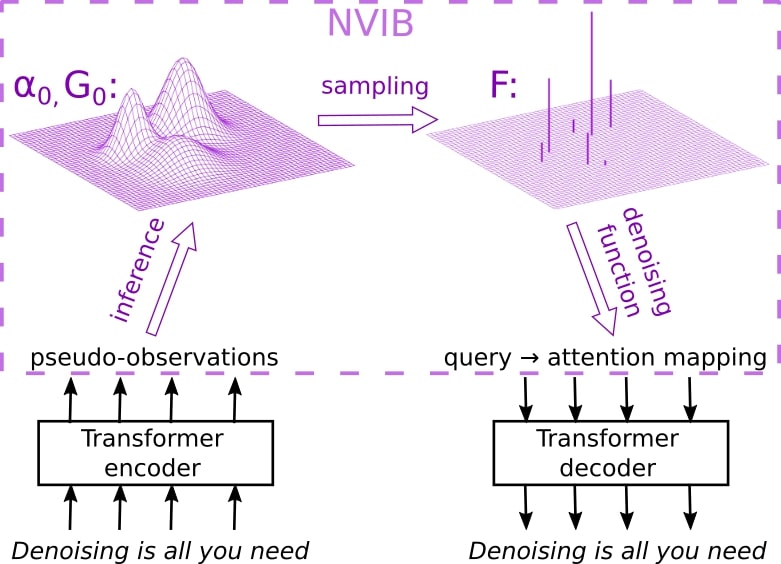

..
.. SPDX-FileCopyrightText: Copyright © 2023 Idiap Research Institute <contact@idiap.ch>
..
.. SPDX-FileContributor: Fabio J Fehr <fabio.fehr@idiap.ch>
..
.. SPDX-License-Identifier: GPL-3.0-only
..

================================================================================================================
A VAE for transformers using Nonparametric Information bottleneck
================================================================================================================

[Paper_]

This repository contains the code developed for the paper: `A VAE for transformers using Nonparametric Information bottleneck`__ .

Please cite the original authors for their work in any publication(s) that uses this work:

.. code:: bib

    @inproceedings{henderson23_nvib,
    author    = {James Henderson and Fabio Fehr},
    title     = {{A VAE for Transformers with Nonparametric Variational Information Bottleneck}},
    year      = {2023},
    booktitle = {International Conference on Learning Representations},
    url={https://openreview.net/forum?id=6QkjC_cs03X}
    }

Installation
------------

To create a new conda/mamba environment, install conda_, then mamba_, and simply follow the next steps:

.. code:: bash

    mamba env create -f environment.yml   # Create environment
    mamba activate nvib                   # Activate environment

*NB* This environment also installs the nvib package which is assumed to be in a directory one level above the current directory.

Command-line Usage
-------------------

Data
~~~~~~~~~~~~~~~~~~~~~~
Prepare the data: Split into sentences, preprocessing, store the length distributions. Provide the local path for the
data, otherwise it will download directly from HuggingFace:

.. code:: bash

    python prepareDatasets.py --DATA wikitext2 --LOCAL_PATH None
    python prepareDatasets.py --DATA wikitext103 --LOCAL_PATH None

Training
~~~~~~~~~~~~~~~~~~~~~~

For the forward and reverse perplexity (F-PPL and R-PPL) we require an external langauge model we call
"vanillaTransformer". Once this has been trained we train the model of choice. Logging is done with Weights and Biases (WandB).
However, you may run it without logging on WandB.

.. code:: bash

    python train.py --EXPERIMENT_NAME vanillaTransformer --WANDB_ENTITY [WANDB_ENTITY]
    python train.py --EXPERIMENT_NAME nvib --MODEL NVIB --WANDB_ENTITY [WANDB_ENTITY]

Reconstruction Evaluation
~~~~~~~~~~~~~~~~~~~~~~~~~~

Evaluate the reconstruction of the model

.. code:: bash

    python reconstruction.py --EXPERIMENT_NAME nvib --WANDB_ENTITY [WANDB_ENTITY]

Draw Samples from the prior
~~~~~~~~~~~~~~~~~~~~~~~~~~~~
Draw samples from the model

.. code:: bash

    python sample.py --EXPERIMENT_NAME nvib --WANDB_ENTITY [WANDB_ENTITY]

Forward Perplexity Evaluation
~~~~~~~~~~~~~~~~~~~~~~~~~~~~~~~
Evaluate the forward perplexity of the model

.. code:: bash

    python forwardSampleEvaluation.py --EXPERIMENT_NAME nvib --LANGUAGE_MODEL vanillaTransformer --WANDB_ENTITY [WANDB_ENTITY]

Reverse Perplexity Evaluation
~~~~~~~~~~~~~~~~~~~~~~~~~~~~~~~
Evaluate the reverse perplexity of the model

.. code:: bash

    python reverseSampleEvaluation.py --EXPERIMENT_NAME nvib --LANGUAGE_MODEL vanillaTransformer --WANDB_ENTITY [WANDB_ENTITY]

Interpolation Evaluation
~~~~~~~~~~~~~~~~~~~~~~~~~~
Interpolation between sentences evaluation

.. code:: bash

    python interpolation_evaluation.py --RUN_INTERPOLATIONS True --EXPERIMENT_NAME nvib --WANDB_ENTITY [WANDB_ENTITY]

Repository Structure
-----------------------------

.. code:: bash

    .
    ├── classes
    │   ├── Dataset.py
    │   ├── MetricsAverage.py
    │   ├── Transformer.py
    │   ├── VariationalTransformerNVIB.py
    │   ├── VariationalTransformerPooled.py
    │   ├── VariationalTransformerStride.py
    │   └── VariationalTransformerVariable.py
    ├── data
    │   └── 
    ├── environment.yml
    ├── forwardSampleEvaluation.py
    ├── interpolation_evaluation.py
    ├── LICENSES
    │   └── GPL-3.0-or-later.txt
    ├── outputs
    │   └── 
    ├── prepareDatasets.py
    ├── README.rst
    ├── reconstruction.py
    ├── reverseSampleEvaluation.py
    ├── sample.py
    ├── train.py
    └── utils.py

Contact
---------
For questions or reporting issues to this software package, kindly contact the second author_.

.. _author: fabio.fehr@idiap
.. _Paper: https://openreview.net/forum?id=6QkjC_cs03X
.. _conda: https://conda.io
.. _mamba: https://mamba.readthedocs.io/en/latest/installation.html#existing-conda-install
__ https://openreview.net/forum?id=6QkjC_cs03X
